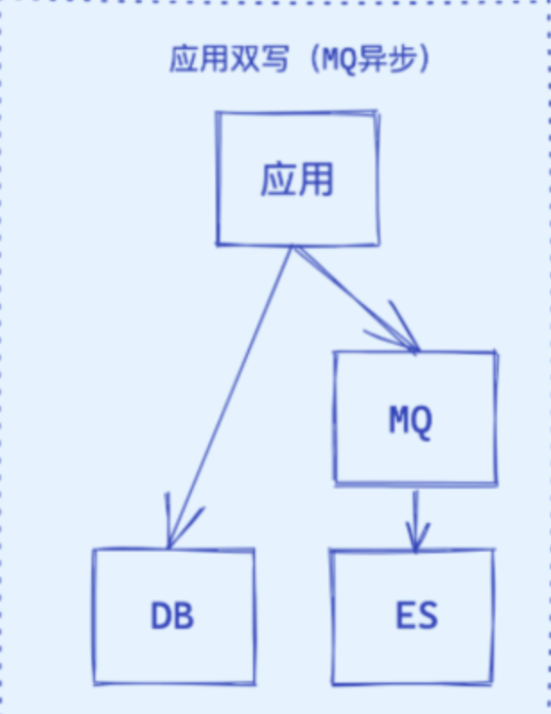

## ES和Mysql的区别

| **项目** | **MySQL**             | **Elasticsearch**                           |
| -------- | --------------------- | ------------------------------------------- |
| 类型     | 关系型数据库（RDBMS） | 分布式搜索引擎 / 文档数据库                 |
| 数据模型 | 表（表结构+行）       | JSON 文档（Schema-Free）                    |
| 查询能力 | 精确匹配、事务处理    | 全文检索、模糊匹配、复杂查询（bool、range） |
| 适用场景 | OLTP（事务性系统）    | 搜索、日志分析、实时推荐等                  |

- MySQL：基于结构化数据，数据存储在表格中，字段类型固定（如 int, varchar, datetime）
- Elasticsearch：以文档（JSON）的形式存储，每条记录是一个独立的文档，灵活支持嵌套、数组

## 初识ES

Elasticsearch是由elastic公司开发的一套搜索引擎技术，它是elastic技术栈中的一部分。完整的技术栈包括：

- Elasticsearch：用于数据存储、计算和搜索
- Logstash/Beats：用于数据收集
- Kibana：用于数据可视化

## 倒排索引

- 文档（`Document`）：用来搜索的数据，其中的==每一条数据就是一个文档==。例如一个网页、一个商品信息
- 词条（`Term`）：对文档数据或用户搜索数据，利用某种算法分词，得到的具备含义的词语就是词条。例如：我是中国人，就可以分为：我、是、中国人、中国、国人这样的几个词条

创建流程：

- 将每一个文档的数据利用分词算法根据语义拆分，得到一个个词条
- 创建表，每行数据包括词条、词条所在文档id、位置等信息
- 因为词条唯一性，可以给词条创建正向索引

此时形成的这张以词条为索引的表，就是倒排索引表


搜索流程：

1. 用户输入条件`"华为手机"`进行搜索。
2. 对用户输入条件分词，得到词条：`华为`、`手机`。
3. 拿着词条在倒排索引中查找（由于词条有索引，查询效率很高），即可得到包含词条的文档id：`1、2、3`。
4. 拿着文档`id`到正向索引中查找具体文档即可（由于`id`也有索引，查询效率也很高）。

> 先查询倒排索引，再查询正排索引

-  正向索引是最传统的，根据id索引的方式。但根据词条查询时，必须先逐条获取每个文档，然后判断文档中是否包含所需要的词条，是根据文档找词条的过程。 
-  而倒排索引则相反，是==先找到用户要搜索的词条，根据词条得到保护词条的文档的id，然后根据id获取文档。是根据词条找文档的过程==。 

## 映射关系

| **数据库术语**      | **Elasticsearch术语** | **说明**                   |
| ------------------- | --------------------- | -------------------------- |
| 表（Table）         | 索引（Index）         | 每张表对应一个 ES 索引     |
| 行（Row）           | 文档（Document）      | 每行数据是一条文档         |
| 列（Column）        | 字段（Field）         | 每个列名转为 JSON 的字段名 |
| 主键（Primary Key） | _id 字段              | 通常用主键做 ES 文档 ID    |


> **映射（mapping）**，是索引中文档的字段约束信息，类似<u>表的结构约束。</u>

-  Mysql：擅长事务类型操作，可以确保数据的安全和一致性 
-  Elasticsearch：擅长海量数据的搜索、分析、计算 

## 如何实现Mysql和ES同步

### 同步双写


这是一种最为简单的方式，在将数据写到 MySQL 时，同时将数据写到 ES。

优点：

- 业务逻辑简单；
- 实时性高。

缺点：

- 硬编码，有需要写入 MySQL 的地方都需要添加写入 ES 的代码；
- 业务强耦合；
- 存在双写失败丢数据风险；
- ==性能较差==，本来 MySQL 的性能不是很高，再加一个 ES，系统的性能必然会下降。

### 异步双写



优点：

- 性能高；
- 不易出现数据丢失问题，主要基于 MQ 消息的消费保障机制，比如 ES 宕机或者写入失败，还能重新消费 MQ 消息；
- 多源写入之间相互隔离，便于扩展更多的数据源写入。

缺点：

- 硬编码问题，接入新的数据源需要实现新的消费者代码；
- 系统复杂度增加，引入了消息中间件；
- MQ是异步消费模型，用户写入的数据不一定可以马上看到，==造成延时==。

### 基于 SQL 抽取


上面两种方案中都存在硬编码问题，代码的侵入性太强，如果对实时性要求不高的情况下，可以考虑用定时器来处理：

1. 数据库的相关表中增加一个字段为 timestamp 的字段，任何 CURD 操作都会导致该字段的时间发生变化；
2. 原来程序中的 CURD 操作不做任何变化；
3. 增加一个定时器程序，让该程序按一定的时间周期扫描指定的表，把该时间段内发生变化的数据提取出来；
4. 逐条写入到 ES 中。

### *** 基于 Binlog 实时同步**

既能保证数据同步的实时性又没有代入侵入


具体步骤如下：

- 读取 MySQL 的 Binlog 日志，获取指定表的日志信息；
- 将读取的信息转为 MQ；
- 编写一个 MQ 消费程序；
- 不断消费 MQ，每消费完一条消息，将消息写入到 ES 中。

优点：

- 没有代码侵入、没有硬编码；
- 原有系统不需要任何变化，没有感知；
- 性能高；
- 业务解耦，不需要关注原来系统的业务逻辑。

缺点：

- 构建 Binlog 系统复杂；
- 如果采用 MQ 消费解析的 Binlog 信息，也会像方案二一样存在 MQ 延时的风险。

### 数据迁移工具Canal

基于数据库增量日志解析，提供增量数据订阅&消费，目前主要支持 MySQL。

Canal 原理就是伪装成 MySQL 的从节点，从而订阅 master 节点的 Binlog 日志，主要流程为：

1. Canal 模拟一个 MySQL slave（伪装成从库）
2. 使用 COM_BINLOG_DUMP 命令与 MySQL 主库建立连接
3. 实时拉取 binlog 日志（增删改操作）
4. 解析 binlog → JSON → 发给下游（比如 Kafka、ES）

#### 如何不丢数据？

| 保证机制                     | 作用                                       |
| ---------------------------- | ------------------------------------------ |
| ✅ Binlog 拉取是顺序的        | Canal 从 MySQL binlog 顺序拉取数据         |
| ✅ ==位点==（Position）管理   | 拉取的位置会被记录，宕机后可以恢复         |
| ✅ 事务级别消费               | 每条数据都有 binlog 的位点和事务上下文     |
| ✅ ==ACK== 确认机制（消费端） | 发送到 MQ 后必须成功确认才提交位点         |
| ✅ 断点续传能力               | Canal 重启后从上一次的位点继续，不会丢数据 |

## *** IK分词器**

倒排索引依赖于对文档内容的分词，而分词则需要高效、精准的分词算法

**IK 分词器（IKAnalyzer）**是 Elasticsearch 中非常常用的中文分词插件，它支持多种分词模式，尤其适用于中文全文搜索、商品搜索、日志分析等场景。

分词器的作用是什么？

- 创建倒排索引时，对文档分词
- 用户搜索时，对输入的内容分词

IK分词器有几种模式？

- `ik_smart`：智能切分，粗粒度，尽量按“最少词数”分词（适合查询）
- `ik_max_word`：最细切分，细粒度，尽量“穷尽所有可能的词”（适合索引）

### ***工作原理**

1. ==字符过滤器==：处理原始文本，例如去除 HTMI标签。
2. ==分词器==：将文本切分成独立的词条（Tokens），决定如何拆分文本。
3. ==词项过滤器==：对切分后的单词加工，包括转小写，切除停用词，添加近义词

## 索引库的CRUD

使用Kibana的DevTools来编写请求做测试

### 创建索引库和映射

基本语法：

- 请求方式：`PUT`
- 请求路径：`/索引库名`，可以自定义
- 请求参数：`mapping`映射

> Mapping 中的字段类型只能增加不能修改

```java
PUT /索引库名称
{
  "mappings": {
    "properties": {
      "字段名":{
        "type": "text",
        "analyzer": "ik_smart"
      },
      "字段名2":{
        "type": "keyword",
        "index": "false"
      },
      "字段名3":{
        "properties": {
          "子字段": {
            "type": "keyword"
          }
        }
      },
      // ...略
    }
  }
}
```

示例：

```JSON
PUT /heima
{
  "mappings": {
    "properties": {
      "info":{
        "type": "text",
        "analyzer": "ik_smart"
      },
      "email":{
        "type": "keyword",
        "index": "false"
      },
      "name":{
        "properties": {
          "firstName": {
            "type": "keyword"
          }
        }
      }
    }
  }
}
```

- type 是字段的数据类型，决定字段如何解析和存储；
- index 是字段是否参与搜索、是否建立索引

#### type

| **类型**        | **用途**                                    |
| --------------- | ------------------------------------------- |
| text            | 分词文本，支持全文搜索（默认使用 analyzer） |
| keyword         | ==不分词==，适合做精确匹配、分组（聚合）    |
| integer / float | 数值字段，支持范围查询                      |
| boolean         | 布尔值                                      |
| date            | 日期字段，支持时间范围查询                  |
| geo_point       | 地理坐标                                    |
| nested          | 嵌套结构（数组中的对象）                    |

> keyword 不走分词器，而 text会走分词器
>
> 使用keyword 关键字查询效率更高，一般在fields 中定义keyword类型字段

#### index

| 配置                | 含义                                   |
| ------------------- | -------------------------------------- |
| index: true（默认） | 参与搜索，支持查询、过滤               |
| index: false        | 不参与搜索，仅存储展示或聚合，不可查询 |

### 查询

```Plain
GET /heima
```

### 修改索引库

索引库**一旦创建，无法修改mapping**。

但是却允许添加新的字段到mapping中，因为不会对倒排索引产生影响。

```JSON
PUT /索引库名/_mapping
{
  "properties": {
    "新字段名":{
      "type": "integer"
    }
  }
}
```

示例：

```JSON
PUT /heima/_mapping
{
  "properties": {
    "age":{
      "type": "integer"
    }
  }
}
```

### 删除索引库

```Plain
DELETE /heima
```

## mapping映射属性

### 什么是Mapping

Mapping（映射）定义字段名称、数据类型、优化信息（比如是否索引)、分词器，有点类似于数据库中 的表结构定义。一个 Index 对应一个 Mapping。

- 动态 Mapping：根据待索引数据自动建立索引、自动定义映射类型。 
- 显示 Mapping：手动控制字段的存储和索引方式比如哪些字符串字段应被视为全文字段。

如果索引不存在，Elasticsearch 会自动根据数据类型 ==自动推断 Mapping 信息== （Dynamic Mapping），但有时候不是很准确。

> 在索引中定义太多字段会导致<u>映射爆炸</u> ， 从而导致内存不足的错误和难以恢复的情况。使用 <u>映射限制设置</u> 来限制字段映射的数量

### 项目中映射关系

id, name, price, stock, category, brand, sold, isAD

| 字段名       | 字段类型  | 类型说明               | 参与搜索 | 参与分词 | 分词器 |
| ------------ | --------- | ---------------------- | -------- | -------- | ------ |
| id           | `long`    | 长整数                 | 是       |          | ——     |
| name         | `text`    | 字符串，参与分词搜索   | 是       | 是       | IK     |
| price        | `integer` | 以分为单位，所以是整数 | 是       |          | ——     |
| stock        | `integer` | 字符串，但需要分词     | 是       |          | ——     |
| image        | `keyword` | 字符串，但是不分词     |          |          | ——     |
| category     | `keyword` | 字符串，但是不分词     | 是       |          | ——     |
| brand        | `keyword` | 字符串，但是不分词     | 是       |          | ——     |
| sold         | `integer` | 销量，整数             | 是       |          | ——     |
| commentCount | `integer` | 评价，整数             |          |          | ——     |
| isAD         | `boolean` | 布尔类型, 是否上架     | 是       |          | ——     |
| updateTime   | `Date`    | 更新时间               | 是       |          | ——     |

```java
PUT /items
{
  "mappings": {
    "properties": {
      "id": {
        "type": "keyword"
      },
      "name":{
        "type": "text",
        "analyzer": "ik_max_word"
      },
      "price":{
        "type": "integer"
      },
      "stock":{
        "type": "integer"
      },
      "image":{
        "type": "keyword",
        "index": false
      },
      "category":{
        "type": "keyword"
      },
      "brand":{
        "type": "keyword"
      },
      "sold":{
        "type": "integer"
      },
      "commentCount":{
        "type": "integer",
        "index": false
      },
      "isAD":{
        "type": "boolean"
      },
      "updateTime":{
        "type": "date"
      }
    }
  }
}
```

## * **集群**

### **协调节点**

Elasticsearch 7.9 之前的版本中的节点类型：数据节点、协调节点、候选主节点、ingest 节点。在Elasticsearch 7.9 以及之后，节点类型升级为节点角色（Node roles）。节点角色分的很细：数据节点角色、主节点角色、ingest 节点角色、热节点角色等。

- **<u>主节点</u>**（Master-eligible node）：==创建或删除索引、跟踪哪些节点是集群的一部分，以及决定将哪些分片分配给哪些节点==。任何不是仅投票主节点的合格主节点都可以通过主选举过程被选为主节点。
  - 主节点候选（Dedicated master-eligible node）：Elasticsearch 集群中，设置了只能作次主节点的节点。设置专用主节点主要是为了保障集群增大时的稳定性，建议专用主节点个数至少为3个。
  - 仅投票主节点 （Voting-only master-eligible node）：仅参与主节点选举投票，不会被选为主节点，硬件配置可以较低。

> 任意时刻只有一个 <u>活跃的主节点</u>（Active Master Node），推荐采用至少 3 个<u>主节点候选</u>。
>
> ==主节点负责集群管理，比如分片分配、节点加入等，并不参与文档数据的实际写入。==

- **<u>数据节点</u>**（data node）：数据存储和数据处理比如 CRUD、搜索、聚合。
- **<u>协调节点</u>**（coordinating only node）：==路由分发请求、聚集搜索或聚合结果==。
  - 协调节点会根据文档 ID 计算出目标分片，再把请求发送到主分片所在节点，由主分片处理并同步副本，最终返回结果
- **远程节点**（Remote-eligible node）：跨集群检索或跨集群复制。
- **预处理节点**（ingest node）：执行由预处理管道组成的预处理任务。用于读写分离


> 当一个查询请求到达 仅==协调节点==（coordinating only node） 后，仅协调节点会根据路由公式计算出目标分片，然后再将请求转发到目标分片的主分片节点上。

### 分片是什么？有什么用？

在创建索引时，可以指定==索引分片的个数==，==副本的个数==等。分片又可以分为==主分片和副本分片==。

分片（Shard） 是集群数据的容器，Index（索引）被分为多个文档碎片存储在分片中，分片又被分配到集群内的各个节点里。当需要查询一个文档时，需要先找到其位于的分片。

| **操作**     | **说明**                                           |
| ------------ | -------------------------------------------------- |
| ✅ 数据写入   | 所有写操作必须先发到 Primary Shard                 |
| ✅ 写操作复制 | Primary 执行成功后再将数据同步到对应 Replica Shard |
| ✅ 查询       | 查询可从 Primary 或 Replica 任一读取（默认随机选） |


- 分片是 Elasticsearch 在集群内分发数据的单位。
- 整个 Elasticsearch 集群的核心就是==对所有的分片执行分布存储，索引，负载，路由的工作。==
- 副本分片主要是为了提高可用性，由于副本分片同样会占用资源，不建议为一个主分片分配过多的副本分片。
- ==当我们写索引数据的时候，只能写在主分片上，然后再同步到副本分片。==
- 当主分片出现问题的时候，会从可用的副本分片中选举一个新的主分片。

> 从 Elasticsearch 版本 7 开始，每个索引的主分片数量的**默认值为 1**，默认的副本分片数为 **1**

### 自定义路由有什么好处？

默认的路由规则会尽量保证数据会均匀地保存到每一个分片上面。

- 好处是，一旦某个分片出了故障，ES 集群里的任何索引都不会出现一个文档都查不到的情况
- 弊端，文档均匀分配到多个分片上面了，所以每次查询索引结果都需要向多个分片发送请求，然后再将这些分片返回的结果融合到一起返回到终端

### * **写入流程**

1. 客户端发送请求到某个节点 A
2. 节点 A 收到请求后，立即临时承担协调节点角色
   - 路由计算
   - 分发请求到==主分片==所在节点
   - 等待主分片处理、再转发给副本
   - 聚合结果
   - 返回响应给客户端
3. 路由到主分片。根据文档的 ID 和索引的分片数（number_of_shards），协调节点会计算出目标主分片的位置
4. 请求被转发到主分片所在节点。路由计算完成后，协调节点将请求转发到主分片所在的节点
5. 主分片执行写操作。主分片节点处理写操作，更新内部的文档、倒排索引，并把数据写入内存和事务日志
   - 主分片成功写入后，才会进一步同步到副本分片
6. 同步到副本分片
7. 返回响应。当==主分片和所有副本分片都成功处理并同步数据后，协调节点会收到所有分片的确认==，最后将响应返回给客户端

> 为什么说 ES 是==最终一致性系统？==
>
> - 写是强一致性的
> - 读是最终一致性的。写入数据后，不会立刻被搜索到， 刷新后才可见

### *** 检索流程**

1. 由协调节点进行请求的分发，发送到各个检索节点上。
2. 每个数据节点的各自进行检索，并返回检索结果给协调节点，这一段各个数据节点的耗时即“数据节点查询耗时”。
3. 协调节点等待所有数据节点的返回，协调节点选取 Top K 后进行 fetch 操作。1～3 步的完整耗时为“完整链路查询耗时”。

### **ES的分页了解吗？如何实现深度翻页？**

- 根据你的 from + size，先排序出所有匹配文档，再跳过前 from 条，返回 size 条结果
- 当 from 很大时（如几万、几十万），ES 仍然要扫描前面所有数据，性能急剧下降

解决方法：

- ==search_after==：通过上一次返回结果的“排序字段值”，进行游标式分页。
- Scroll：适合批量导出、数据迁移等一次性全量扫描场景。
- ==Point in Time（PIT）==：类似数据库中的一致性快照，返回一个 PIT ID，然后在分页查询中携带
  - 保证整个查询期间数据不变（避免分页过程中数据变动导致结果重复/遗漏

> search_after + PIT 是目前最推荐的深度分页组合方案

## 索引优化

### Elasticsearch 索引优化策略有哪些？

- ES 提供了 ==Bulk API== 支持批量操作，当我们有大量的==写任务==时，可以使用Bulk来进行批量写入。不过，使用Bulk 请求时，每个请求尽量不要超过几十 M，因为太大会导致内存使用过大。

- ES 设置副本数量为1或者0，提高写入索引的效率。

- ES 在写入数据的时候，采用延迟写入的策略，默认1 秒之后将内存中 segment 数据刷新到磁盘中，此时我们才能将数据搜索出来。这就是为什么 Elasticsearch 提供的是近实时搜索功能。某些业务场景下，可以增加刷新时间间隔比如设置刷新时间间隔为30s（index.refresh_interva1=30s），减少 segment 合并压力，提高写入索引的效率。

- 加大 index_buffer_size，这个是 ES 活跃分片共享的内存区，官方建议每个分片至少 512MB， 且为JVM 内存的 10%。

- 使用ES 的默认ID生成策略或使用数字类型ID 做为主键。

- ==合理的配置使用 index 属性==，analyzed 和 not_analyzed，根据业务需求来控制字段是否分词或不分词。只有 groupby 需求的字段，配置时就设置成 not_analyzed，以提高查询或聚类的效率。
- ==加大 Flush 设置==。Flush 的主要目的是把文件缓存系统中的段持久化到硬盘，当 Translog 的数据量达到 512MB 或者30分钟时，会触发一次 Flush，我们可以加大 index.translog.flush_threshold_size，但必须为操作系统的文件缓存系统留下足够的空间。

### Elasticsearch 查询优化策略有哪些？

- 建立冷热索引库（可用固态硬盘存放热库数据，普通硬盘存放冷库数据），热库数据可以提前预热加载至内存，提高检索效率。

- ==自定义路由规则==，让某一类型的文档都被存储到同一分片。
- 使用 copy_to 将多个字段整合为一个。

- ==控制字段的数量==，业务中不使用的字段，就不要索引。
- 不要返回无用的字段，使用_source 进行指定。

- ==避免大型文档存储==，默认最大长度为 100MB。
- ==使用keyword数据类型==，该类型不会走分词器，效率大大提高。
- 开启慢查询配置定位慢查询。

- ES 查询的时候，使用 filter 查询会使用query cache，如果业务场景中的过滤查询比较多，建议将 querycache 设置大一些，以提高查询速度。

- 尽量避免==分页过深==。

- 增加分片副本提高查询吞吐量，避免使用通配符。

- 加大堆内存，ES 默认安装后设置的内存是1GB，可以适当加大但不要超过物理内存的50%，且最好不要超过 32GB。

- 分配一半物理内存给==文件系统缓存==，以便加载热点数据。

# 2.Netty

- Netty 是一个 基于 NIO 的 client-server(客户端服务器)**框架**，使用它可以快速简单地开发网络应用 程序。

- 它极大地简化并优化了 TCP 和 UDP 套接字服务器等网络编程,并且性能以及安全性等很多方面甚至 都要更好。
- 支持多种协议 如 FTP，SMTP，HTTP 以及各种二进制和基于文本的传统协议。

### Netty 的核心组件？

**Bytebuf（字节容器**）：网络通信最终都是通过字节流进行传输的。 ByteBuf 就是 Netty 提供的一个字节容器，其内部是一个 ==字节数组==

**Bootstrap 和 ServerBootstrap（启动引导类）**：客户端/服务端启动类

```
都使用 bind() 方法绑定本地的端口上
Bootstrap 只需要配置一个线程组— EventLoopGroup 
ServerBootstrap需要配置两个线程组 — EventLoopGroup，一个用于接收连接，一个用于具体的 IO 处理。
```

**Channel（网络操作抽象类）**

**EventLoop（事件循环）**==负责监听网络事件并调用事件处理器进行相关 I/O 操作（读写） 的处理。==

> - Channel 为 Netty 读写等操作抽象类，EventLoop 负责处理注册到其上的Channel 的 I/O 操作，两者配合进行 I/O 操作。
> - EventLoopGroup 包含多个 EventLoop，它管理着所有 的 EventLoop 的生命周期。
> - EventLoop 处理的 I/O 事件都将在它专有的 Thread 上被处理，即 ==Thread 和 EventLoop 属于 1 : 1 的关系==，从而保证线程安全


**ChannelHandler（消息处理器） 和 ChannelPipeline（ChannelHandler 对象链表）**

> 默认的构造函数实际会起的线程数为 ==CPU核心数*2。==

### Reactor 线程模型（Netty线程模型）

Reactor 模式基于事件驱动，特别适合处理海量的 I/O 事件。 

Reactor 线程模型分为<u>单线程模型、多线程模型以及主从多线程模型</u>。

单线程模型：一个线程需要执行处理所有的 accept、read、decode、process、encode、send 事件

多线程模型：一个 Acceptor 线程只负责监听客户端的连接，一个 NIO 线程池负责具体处理： accept、read、 decode、process、encode、send 事件

主从多线程模型：从一个 主线程 NIO 线程池中选择一个线程作为 Acceptor 线程，绑定监听端口，接收客户端连接的连 接，其他线程负责后续的接入认证等工作。连接建立完成后，Sub NIO 线程池负责具体处理 I/O 读写。

### 什么是 TCP 粘包/拆包?有什么解决办法呢？

TCP 粘包/拆包 就是你基于 TCP 发送数据的时候，出现了多个字符串“粘”在了一起或者一个字符 串被“拆”开的问题。

- 使用 Netty 自带的解码器
- 自定义序列化编解码器

### Netty 长连接、心跳机制了解么？

### Netty 的零拷贝了解么？

在 OS 层面上的 Zero-copy 通常指==避免在 用户态(User-space) 与 内核态(Kernel-space) 之间来回拷贝数 据==

Netty 中的零拷贝体现在以下几个方面

1. 使用 Netty 提供的 CompositeByteBuf 类, 可以==将多个ByteBuf 合并为一个逻辑上的 ByteBuf,== 避免 了各个 ByteBuf 之间的拷贝。

2. ByteBuf 支持 slice 操作, 因此可以==将 ByteBuf 分解为多个共享同一个存储区域的 ByteBuf,== 避免了 内存的拷贝。

3. 通过 FileRegion 包装的FileChannel.tranferTo 实现文件传输, 可以==直接将文件缓冲区的数据发送到 目标 Channel==, 避免了传统通过循环 write 方式导致的内存拷贝问题.
